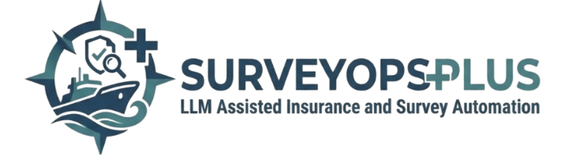
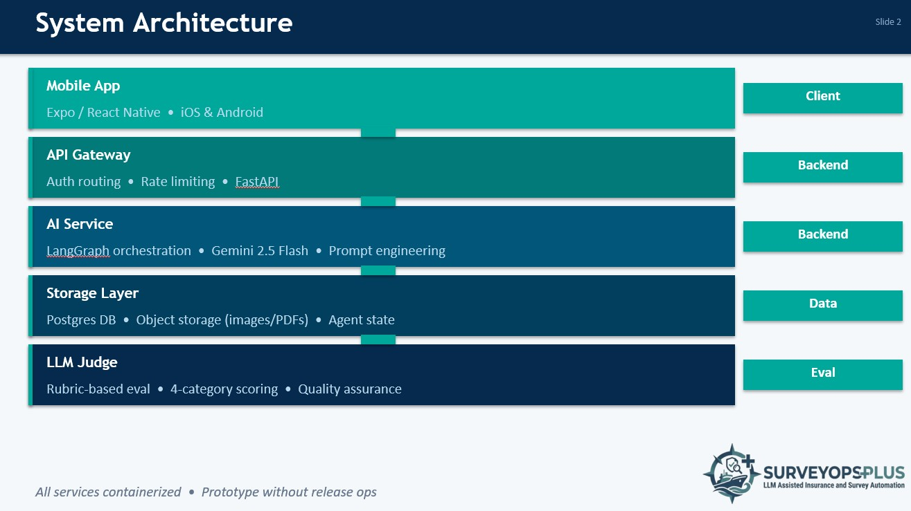
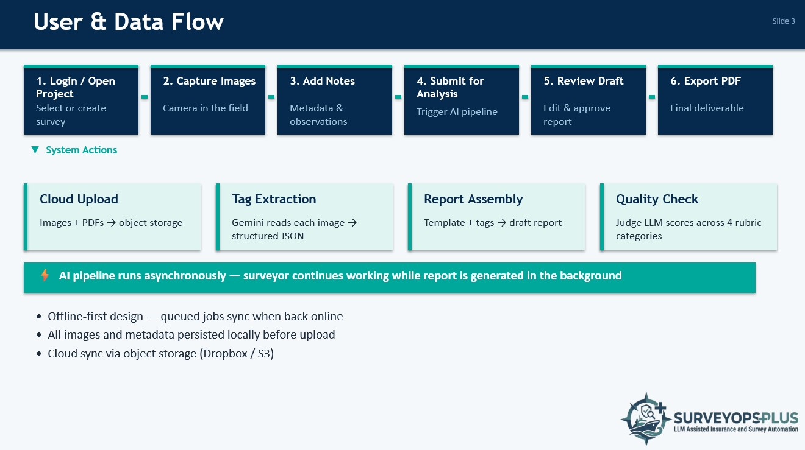

# SurveyOps+
### LLM-Assisted Marine Container Survey Automation

**[Demo Video](https://drive.google.com/file/d/1jvsvf6or1QAlXVt80uJkQZy0IKN_8iR5/view)**

---

## 📋 The Problem

Marine surveyors — the specialists who inspect shipping containers for insurance claims and cargo damage assessments — operate on a completely manual pipeline:

Visit the site and photograph damage with a phone
Transfer images via cable to a laptop
Manually analyze each photo, hand-write observation tags
Type up a detailed compliance report from memory — hours after the inspection

This process is slow, error-prone, and fully synchronous. Inside containers there's no connectivity, so everything is offline. Photos accumulate unlabeled. By the time the surveyor is at their desk, they're reconstructing the scene from memory across hundreds of images.
No purpose-built tool exists for this workflow. Generic document automation exists — but nothing targeting marine container surveys specifically.

---

## 🔨 What We Built

SurveyOps+ is an AI-powered mobile application that automates the marine survey pipeline end-to-end — from field image capture to a compliance-ready draft report.
The surveyor captures photos in the field. The system handles tagging, analysis, report generation, and quality evaluation. The surveyor reviews, corrects, and signs off. It's a force multiplier, not a replacement — the expert judgment stays human; the friction gets automated.

---

## ✨ Features

✅ **Offline-first mobile app** — images queue locally in SQLite and sync when connectivity is restored
✅ **Field Capture** — Capture or upload survey images directly from an iOS/Android mobile app
✅ **AI Image Tagging** — Gemini 2.5 Flash analyzes each image against compliance manuals and extracts structured observations as tags (damage type, container IDs, temperature readings, seal conditions)
✅ **Automated Report Drafting** — Tags are assembled with a report template and sample reports to generate a professional `.docx` draft
✅ **Judge LLM Eval Pipeline** — A second LLM instance scores each generated report against a rubric across 8 categories for automated quality assurance
✅ **Evidence Grounding** — Every claim is traceable back to a specific image; the model is explicitly prompted to make no unsupported claims
✅ **Human-in-the-Loop** — Expert review and sign-off before any report is finalized
✅ **Cloud Sync** — Images and project data sync to Dropbox/S3 with offline-first support
✅ **Report Export** — Download the final report as a `.docx` file

---

## 🏗️ System Architecture

---

## 🔄 User & Data Flow

---

## 🧠 The Judge LLM

The hardest problem in this domain is trust — LLMs hallucinate, and in insurance-grade survey reports every claim must trace back to a specific photo. Having a human review every output defeats the purpose of automation.

**Our solution:** A second LLM instance acts as an independent judge, scoring each generated report against a rubric — no human needed for routine quality checks.

### Rubric Categories (8 total)

| Category | What It Checks |
|---|---|
| Semantic Comparison | Overall meaning matches the reference report |
| Report Quality | Professional tone, language, and completeness |
| Structural Completeness | All template sections present |
| Causation Language | Correct causal framing of damage observations |
| Compliance | Adherence to industry standards and regulations |
| Evidence Grounding | Every claim traceable to a specific image |
| Quantitative Accuracy | Correct readings, unit conversions, thresholds |
| Image Accuracy | Descriptions match what is visually present |

---

## ⚙️ Tech Stack

| Layer | Technology |
|---|---|
| Mobile Frontend | Expo / React Native (iOS & Android) |
| Local Mobile DB | SQLite via Drizzle ORM |
| API Gateway | FastAPI + Python |
| AI Orchestration | LangGraph |
| Multimodal LLM | Google Gemini 2.5 Flash |
| Backend Database | PostgreSQL |
| Cloud Storage | Dropbox / Amazon S3 |
| Containerization | Docker |
| E2E Testing | Detox + Jest |

---

## 🚀 Getting Started

### Prerequisites

| Tool | Version |
|---|---|
| Python | 3.10+ |
| Node.js | 18+ |
| Docker | Latest |
| Docker Compose | Latest |
| Expo CLI | Latest |

You will also need:
- A **Google Gemini API key** from [Google AI Studio](https://aistudio.google.com/)
- A **Dropbox developer app** (App Key + App Secret) from [dropbox.com/developers](https://www.dropbox.com/developers/apps)

### Backend Setup

See [backend/README.md](backend/README.md) for full setup instructions, environment variables, and the Dropbox OAuth flow.

### Frontend Setup

See [frontend/README.md](frontend/README.md) for full setup instructions including iOS simulator and Android emulator configuration.

---

## 👥 The Team
UCI Donald Bren School of Information & Computer Sciences — MCS Capstone 2026

| Name | Role |
|---|---|
| [Shrey Deshmukh](https://linkedin.com/in/shrey-deshmukh) | Backend Engineer |
| [Kurian Thomas Pulimoottil](https://linkedin.com/in/kurian-thomas-pulimoottil) | Fullstack Engineer |
| [Harshaun Khehra](https://linkedin.com/in/harshaunkhehra) | Frontend Engineer |
| [Richard Zou](https://linkedin.com/in/richardzou26) | Backend Engineer |

---

## Documentation

- [Backend Setup & API Reference](backend/README.md)
- [Platform Prerequisites](backend/docs/README.md)
- [Frontend Setup](frontend/README.md)
- [E2E Testing Guide](frontend/tests/readme.md)

---

<i>UC Irvine · Donald Bren School of Information and Computer Sciences · MCS Capstone 2026</i>

